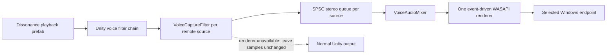

# Audio Routing Architecture

This design assumes the playback format and source assignment documented under
[Lethal Company voice playback](../domain/lethal-company-voice-playback.md)
and the [Windows Core Audio contract](../domain/windows-core-audio.md).

## Invariants

- The local player's voice source is never registered for alternate routing.
- Each remote source has one single-producer, single-consumer stereo queue.
- One WASAPI renderer mixes all registered queues; sources never write sequentially to the endpoint buffer.
- Unity callback data is cleared only when the renderer is ready and the complete callback block was queued.
- Endpoint failure restores normal Unity voice output without requiring a game restart.
- The audio callback performs no COM calls, Unity object traversal, endpoint
  enumeration, steady-state allocation, or logging.

## Data path

`VoiceCaptureFilter.OnAudioFilterRead` converts mono to duplicated stereo or
takes the first two channels from a multichannel callback.
The target game project is configured for stereo output, but the runtime
protocol still checks the observed callback shape.

The queue accepts a complete callback block or rejects it atomically.
On rejection, the Unity data remains unchanged.
The renderer reads up to the available WASAPI frames from every stream, sums
aligned samples, and clamps the final mix to `[-1, 1]`.

## Concurrency

The Unity audio thread is the sole producer for a source queue.
The WASAPI thread is the sole consumer for all queues.
Ring positions use acquire-and-release volatile operations. Audio samples are
written before the producer publishes its new write sequence.
Queue resets may originate from the control or Unity audio thread. A reset
atomically advances the read sequence, and the consumer publishes its advance
with compare-and-exchange. If a reset wins that race, the copied block is
discarded instead of restoring the pre-reset cursor.

Register and unregister operations replace an immutable stream-array snapshot under a short lock.
Rendering reads the published snapshot without holding that lock.
The render scratch buffer belongs exclusively to the WASAPI thread.

## Endpoint lifecycle

`AudioDeviceSelectionController` resolves the configured ID to an active
endpoint. The router ignores a redundant active selection, while the same
selection resumes a renderer that endpoint enumeration previously suspended.
Changed, resumed, and suspended selections increment a generation and signal
reconfiguration.
The render thread disposes the previous client, opens the new endpoint, and marks readiness only after start succeeds.

Readiness transitions to false before reconfiguration, failure, or shutdown.
That transition clears all queues so old-device latency cannot play after recovery.
The router checks readiness before and after enqueueing. The filter clears the
Unity block only while holding a commit lease on the exact capture
registration used for that submission. Deactivation removes the registration,
waits for an in-progress commit to finish, and only then unregisters its queue;
a retired registration cannot clear a later Unity callback.
Each ready renderer also owns a multi-submission routing epoch. Reconfiguration
removes and retires that epoch before clearing queues, so it cannot invalidate
a submission between its readiness check and Unity-buffer decision. A renderer
opened for an obsolete or suspended selection is discarded before readiness is
published.
Retirement and queue clearing are serialized across the control and render
threads. A callback that committed immediately before retirement can still be
dropped when its old queue is cleared; this bounded transition loss is accepted
to prevent stale voice from playing after recovery without blocking steady-state
audio callbacks.

## Lifetime

The plugin owns the selection controller, Harmony instance, router, render thread, and synchronization handles.
Unity owns each capture component.
On plugin destruction, the static integration context is cleared, patches are
removed, the configuration callback is detached, and the render thread stops.
Capture components may be destroyed later; unregistering remains safe after router shutdown.
